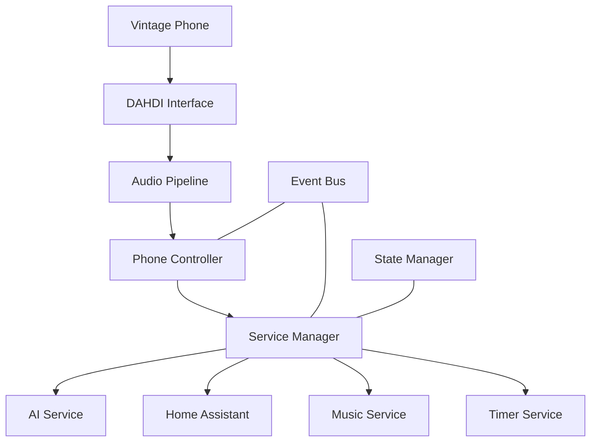
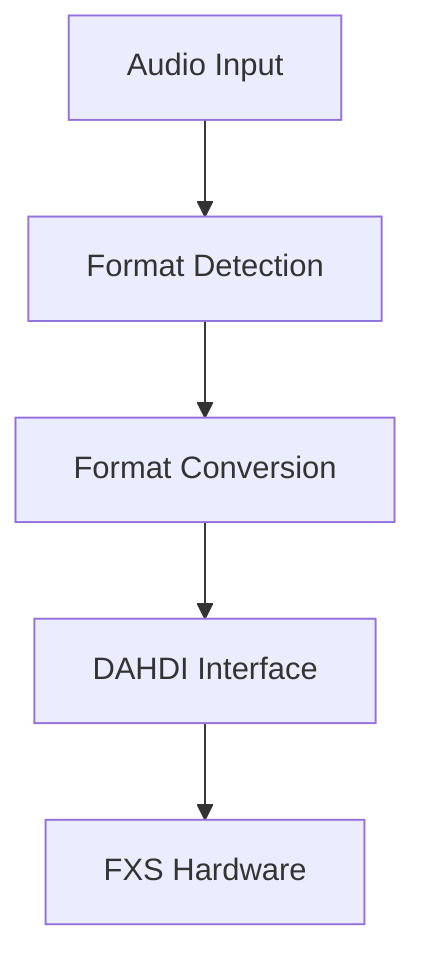

# Iroh Technical Specification

## Core Architecture

The Iroh system is built around these core components:

1. Hardware Layer (DAHDI/FXS Interface)
2. Audio Processing Pipeline
3. Core Services (AI, Home Automation, Music)
4. Phone Controller
5. Event Bus and State Management

### System Overview



## Core Service Interfaces

### PhoneController

```typescript
interface PhoneController {
  // Lifecycle
  start(): Promise<void>;
  stop(): Promise<void>;
  
  // Hardware Control
  playTone(type: string): Promise<void>;
  playAudio(buffer: Buffer): Promise<void>;
  ring(duration?: number): Promise<void>;
  
  // State
  getState(): PhoneState;
  isOpen(): boolean;
  
  // Events
  on(event: 'off_hook', handler: () => void): void;
  on(event: 'on_hook', handler: () => void): void;
  on(event: 'dtmf', handler: (event: DTMFEvent) => void): void;
  on(event: 'voice', handler: (event: VoiceEvent) => void): void;
  on(event: 'error', handler: (error: Error) => void): void;
}
```

### ServiceManager

```typescript
interface ServiceManager {
  // Lifecycle
  initialize(): Promise<void>;
  shutdown(): Promise<void>;
  
  // Service Access
  getAIService(): IrohAIService;
  getHomeAssistant(): HAService;
  getMusicService(): MusicService;
  getTimerService(): TimerService;
  
  // Command Handling
  handleCommand(command: string, data?: Buffer): Promise<void>;
  
  // State
  getState(): ServiceState;
}
```

### AIService (IrohAIService)

```typescript
interface IrohAIService {
  // Text Processing
  processText(text: string): Promise<string>;
  processTextStreaming(text: string): Promise<void>;
  
  // Speech
  generateSpeech(text: string): Promise<Buffer>;
  processVoice(audio: Buffer): Promise<string>;
  
  // Context
  updateContext(key: string, value: any): Promise<void>;
  
  // Lifecycle
  initialize(): Promise<void>;
  shutdown(): Promise<void>;
}
```

### HomeAssistant Service (HAService)

```typescript
interface HAService {
  // Core Operations
  initialize(): Promise<void>;
  shutdown(): Promise<void>;
  
  // Device Control
  getEntityState(entityId: string): Promise<HAEntity>;
  executeCommand(command: string, params?: Record<string, any>): Promise<void>;
  
  // State
  getStatus(): { isConnected: boolean; entityCount: number; lastUpdate: Date };
  
  // Events
  on(event: 'state_changed', handler: (event: HAEvent) => void): void;
}
```

### Hardware Service

```typescript
interface HardwareService {
  // Lifecycle
  initialize(): Promise<void>;
  shutdown(): Promise<void>;
  
  // Audio
  playAudio(buffer: Buffer): Promise<void>;
  
  // Control
  ring(duration?: number): Promise<void>;
  
  // Diagnostics
  runDiagnostics(): Promise<Array<{test: string; passed: boolean; message?: string}>>;
  getStatus(): HardwareStatus;
  
  // Audio Processing
  convertAudioFormat(
      buffer: Buffer,
      sourceFormat: DAHDIAudioFormat
  ): Promise<Buffer>;
  
  getAudioFormat(): Readonly<DAHDIAudioFormat>;
  
  validateAudioFormat(format: Partial<DAHDIAudioFormat>): void;
}
```

### Hardware Interface

```typescript
interface DAHDIInterface {
    start(): Promise<void>;
    stop(): Promise<void>;
    playAudio(buffer: Buffer, format?: Partial<DAHDIAudioFormat>): Promise<void>;
    ring(duration?: number): Promise<void>;
    getStatus(): DAHDIChannelStatus | null;
    isOpen(): boolean;
    getLastError(): Error | null;
}
```

## Audio Processing Architecture

The system implements a robust audio processing pipeline centered around DAHDI's requirements. The core audio processing is handled by two key components:

### DAHDIAudioConverter

The audio conversion system provides format compatibility between modern audio sources and DAHDI's specific requirements through a combination of native JavaScript processing and the Web Audio API's AudioBuffer interface. It handles:

```typescript

interface DAHDITypes {
  // Hardware Configuration
  interface DAHDIConfig {
    devicePath: string;
    controlPath: string;
    sampleRate: 8000; // Must be 8000Hz
    channels: 1;      // Must be mono
    bitDepth: 16;     // Must be 16-bit
    bufferSize: number;
    channel: number;
    monitorInterval?: number;
  }

  // Audio Format
  interface DAHDIAudioFormat {
    sampleRate: 8000;    // DAHDI requires 8kHz
    channels: 1;         // DAHDI is mono only
    bitDepth: 16;        // DAHDI uses 16-bit PCM
    format: 'linear';    // Linear PCM format
  }

  // Channel Configuration
  interface DAHDIChannelConfig {
    channel: number;
    signaling: 'fxs_ls' | 'fxs_gs' | 'fxs_ks';
    echocancel?: {
      enabled: boolean;
      taps: number;
    };
    callerid?: {
      enabled: boolean;
      format: 'bell' | 'v23' | 'dtmf';
    };
    impedance: 600 | 900;
  }

  // Status & Events
  interface DAHDIChannelStatus {
    isOpen: boolean;
    channel: number;
    alarms: number;
    signaling: {
      type: string;
      hookstate: 'onhook' | 'offhook';
      ringing: boolean;
    };
    levels?: {
      rxLevel: number;
      txLevel: number;
    };
  }
}
interface AudioConverterOptions {
    bufferSize: number;
    useWorkers: boolean;
}

```

The converter uses the Web Audio API's AudioBuffer for format handling and implements custom resampling logic. This provides:
- Standards-compliant audio processing
- Efficient memory management
- High-quality channel mixing
- Real-time processing capability
- Minimal audio quality loss during conversion

### Audio Processing Pipeline

The audio path flows through these stages:



1. Input Processing
   - Format detection and validation
   - Buffer size calculation
   - Channel count verification
   - AudioBuffer conversion

2. Format Conversion
   - Linear interpolation resampling to 8kHz
   - AudioBuffer-based channel mixing to mono
   - 16-bit PCM conversion
   - Buffer management

3. DAHDI Output
   - Hardware timing synchronization
   - Buffer underrun prevention
   - Error recovery


## Core Types

### Audio Types

```typescript
interface AudioInput {
  sampleRate: number;
  channels: number;
  bitDepth: number;
  data: Buffer;
}

interface DTMFEvent {
  digit: string;
  duration: number;
  timestamp: number;
}

interface VoiceEvent {
  audio: Buffer;
  startTime: number;
  endTime: number;
  isFinal: boolean;
}
```

### State Types

```typescript
interface ServiceState {
  isInitialized: boolean;
  activeServices: string[];
  lastError?: Error;
}

interface HardwareStatus {
  isInitialized: boolean;
  dahdiStatus: {
    isOpen: boolean;
    lastError?: Error;
    channelStatus: DAHDIChannelStatus | null;
  };
  systemHealth: {
    temperature?: number;
    voltages: Record<string, number>;
    errors: number;
  };
}

type PhoneState = 'idle' | 'off_hook' | 'ringing' | 'in_call' | 'error';
```

### Configuration Types

```typescript
interface Config {
  app: AppConfig;
  audio: AudioConfig;
  ai: AIConfig;
  music: MusicConfig;
  home: HomeConfig;
  logging: LogConfig;
}

interface DAHDIConfig {
  devicePath: string;
  sampleRate: number; // Must be 8000
  channel?: {
    number: number;
    ringCadence: number[];
    callerIdFormat: 'bell' | 'v23' | 'dtmf';
    impedance: 600 | 900;
  };
}
interface AIServiceConfig {
  anthropicKey: string;        // Required
  elevenLabsKey?: string;     // Optional
  openAIKey?: string;         // Optional
  maxTokens?: number;
  temperature?: number;
  voiceId?: string;
}

interface PhoneControllerConfig {
  fxs: {
    devicePath: string;
    sampleRate: number;
    impedance?: number;
  };
  audio: {
    bufferSize: number;
    channels: number;
    bitDepth: number;
    vadThreshold?: number;
  };
  ai?: AIServiceConfig;
  dtmf?: {
    minDuration: number;
    threshold: number;
  };
}


```

### Error Types

Audio-specific error type:
```typescript
export class AudioFormatError extends Error {
    constructor(
        message: string,
        public readonly details: string[]
    ) {
        super(message);
        this.name = 'AudioFormatError';
    }
}
```

### Utility Types

```typescript
interface CircularBufferOptions {
    size: number;
    overwrite?: boolean;
}

class CircularBuffer {
    write(data: Buffer): number;
    read(size: number): Buffer;
    clear(): void;
    getSize(): number;
}
```

## Event System

The system uses a centralized event bus with typed events:

```typescript
interface SystemEvents {
  'system:ready': void;
  'system:error': Error;
  'system:shutdown': void;
}

interface PhoneEvents {
  'phone:offHook': void;
  'phone:onHook': void;
  'phone:dtmf': { digit: string; duration: number };
  'phone:voice': { audio: Buffer; duration: number };
}

interface HomeEvents {
  'home:deviceChange': { deviceId: string; state: any };
  'home:sceneActivated': { sceneId: string };
}

type IrohEvents = SystemEvents & PhoneEvents & HomeEvents;
```


## Implementation Notes

1. DAHDI Integration
   - All audio must use 8kHz sample rate, mono, 16-bit PCM
   - Buffer sizes should be multiples of 160 bytes (20ms frames)
   - Echo cancellation should be configured for 128 taps

2. Error Handling
   - All services should emit typed errors
   - Hardware errors should trigger recovery attempts
   - State changes should be atomic

3. Logging
   - Use Winston logger throughout
   - Log levels: error, warn, info, debug
   - Include context in structured logs

4. Audio Processing
   - All audio must be converted to 8kHz/16-bit/mono format
   - Use node-libsamplerate for sample rate conversion
   - Implement proper buffer management for real-time audio
   - Monitor conversion quality and performance
   - Log format conversion operations for debugging

5. Error Handling
   - Add specific handling for audio format errors
   - Implement fallbacks for conversion failures
   - Monitor conversion performance impact
   - Provide detailed error information for debugging


## Development Process

1. Start with core types and interfaces
2. Implement hardware layer
3. Build service implementations
4. Add controllers and event handling
5. Integrate all components

This specification serves as the authoritative reference for the entire system. All implementations should conform to these interfaces and types.

Let me know if you'd like me to focus on implementing any specific part of this specification or if you need clarification on any section.
