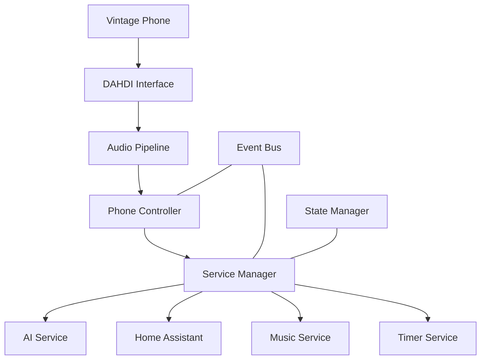

# Iroh Technical Specification

## Project Overview

Iroh is an AI-powered interface for vintage telephones that provides smart home control, voice interaction, and media playback capabilities. The system integrates with DAHDI hardware to bridge analog telephony with modern digital services.

## System Architecture & Component Organization

The system is organized into logical layers that separate concerns while maintaining clear interfaces between components. Each layer has specific implementation requirements and relationships.

### Core Components

1. Hardware Layer
   - DAHDI/FXS Interface
   - Audio Processing Pipeline
   - Hardware Monitoring

2. Service Layer
   - AI Service (Claude & ElevenLabs)
   - Home Assistant Integration
   - Music Service
   - Timer Service

3. Control Layer
   - Phone Controller
   - Service Manager
   - Event Bus
   - State Manager

### Core Layer
- **Purpose**: Provides fundamental system services and coordination
- **Key Components**: EventBus, StateManager, Configuration
- **Requirements**:
  - Must initialize before other layers
  - Handles cross-cutting concerns
  - Provides type-safe interfaces
  - Manages system-wide state

### Hardware Layer
- **Purpose**: Manages DAHDI/FXS hardware interaction
- **Key Components**: DAHDIInterface, AudioPipeline, HardwareService
- **Requirements**:
  - Must maintain DAHDI compatibility (8kHz/16-bit/mono)
  - Implements hardware abstraction
  - Provides error recovery
  - Handles real-time audio processing

### Service Layer
- **Purpose**: Implements business logic and external integrations
- **Key Components**: AIService, HomeService, MusicService, TimerService
- **Requirements**:
  - Services must be independently testable
  - Implements retry and recovery logic
  - Maintains service-specific state
  - Provides clean shutdown

### Controller Layer
- **Purpose**: Coordinates between hardware and services
- **Key Components**: PhoneController, ServiceManager
- **Requirements**:
  - Manages component lifecycle
  - Handles cross-service operations
  - Implements command processing
  - Provides user feedback

### Support Systems
- **Purpose**: Provides cross-cutting functionality
- **Key Components**: Logging, Caching, Error Handling
- **Requirements**:
  - Must be available to all layers
  - Implements consistent interfaces
  - Provides configuration options
  - Maintains performance characteristics

### Implementation Rules
1. Components must communicate through defined interfaces
2. Layer dependencies flow downward only
3. Each component owns its type definitions
4. All operations must be logged appropriately
5. Error handling must be comprehensive
6. State changes must be trackable


### Component Relationships




## Type System

# Type System Organization

- Core types used across multiple components go in index.ts
- Hardware types stay in their own files
- Each major service gets its own type file in service/
- Service types are re-exported through service/index.ts

## Directory Structure

```
src/types/
  ├── index.ts        # Core shared types (Config, Status, Events)
  ├── dahdi.ts        # DAHDI hardware types  
  ├── fxs.ts          # FXS hardware types
  └── service/
      ├── ai.ts       # AI service types
      ├── home.ts     # Home Assistant types
      ├── music.ts    # Music service types
      └── index.ts    # Re-exports service types
```

## Core Types (index.ts)

Core types used across multiple components:

```typescript
// Base configuration interface
export interface Config {
    app: AppConfig;
    audio: AudioConfig;
    logging: LogConfig;
    services: ServiceConfig;
}

// Event system types
export interface EventBusConfig {
    maxHistory?: number;
    debug?: boolean;
}

// Status tracking
export interface ServiceStatus {
    isInitialized: boolean;
    isHealthy: boolean;
    lastError?: Error;
    metrics: ServiceMetrics;
}

// Error types
export class IrohError extends Error {
    constructor(message: string, code: string);
}
```

## Hardware Types

### DAHDI Types (dahdi.ts)
```typescript
export interface DAHDIConfig {
    devicePath: string;
    sampleRate: 8000;
    channels: 1;
    bitDepth: 16;
}

export interface DAHDIChannelStatus {
    isOpen: boolean;
    alarms: number;
    signaling: DAHDISignaling;
}
```

### FXS Types (fxs.ts)
```typescript
export interface FXSConfig {
    channel: number;
    impedance: 600 | 900;
    echoCancel: boolean;
}

export interface FXSStatus {
    voltage: number;
    current: number;
    state: 'idle' | 'ringing' | 'offhook';
}
```

## Service Types

### AI Service (service/ai.ts)
```typescript
export interface AIConfig {
    anthropicKey: string;
    elevenLabsKey?: string;
    maxTokens?: number;
}

export interface ConversationContext {
    history: Message[];
    state: Record<string, any>;
}
```

### Home Assistant (service/home.ts)
```typescript
export interface HAConfig {
    url: string;
    token: string;
    entityPrefix?: string;
}

export interface HAEntity {
    entityId: string;
    state: any;
    attributes: Record<string, any>;
}
```

### Music Service (service/music.ts)
```typescript
export interface MusicConfig {
    provider: 'spotify' | 'apple';
    clientId: string;
    clientSecret: string;
}

export interface PlaybackState {
    isPlaying: boolean;
    currentTrack?: Track;
    volume: number;
}
```

### Service Index (service/index.ts)
```typescript
export * from './ai';
export * from './home';
export * from './music';

export interface ServiceConfig {
    ai: AIConfig;
    home: HAConfig;
    music: MusicConfig;
}
```

## Type System Rules


1. **Core Types**
   - Place in `index.ts` if used across multiple components
   - Keep interfaces focused and minimal
   - Use strict literal types where appropriate
   - Maintain backwards compatibility

2. **Hardware Types**
   - Separate DAHDI and FXS concerns
   - Use hardware-specific constants
   - Include proper validation types
   - Document hardware requirements

3. **Service Types**
   - One file per major service
   - Export through service/index.ts
   - Include configuration and state types
   - Define clear service interfaces

4. **Type Safety**
   - Use strict null checks
   - Prefer unions over enums
   - Define proper error types
   - Include validation helpers

5. **Documentation**
   - Document all public interfaces
   - Include usage examples
   - Note hardware requirements
   - Explain type constraints

## Implementation Guidelines

1. **Type Imports**
   ```typescript
   // Prefer named imports
   import { Config, ServiceStatus } from '../types';
   import { DAHDIConfig } from '../types/dahdi';
   import { AIService } from '../types/service';
   ```

2. **Type Extensions**
   ```typescript
   // Extend base interfaces
   interface CustomService extends ServiceStatus {
     additionalField: string;
   }
   ```

3. **Type Validation**
   ```typescript
   // Include validation helpers
   export function validateConfig(config: Config): string[] {
     const errors: string[] = [];
     // Validation logic
     return errors;
   }
   ```

4. **Type Guards**
   ```typescript
   // Use type guards for runtime checks
   export function isDAHDIError(error: unknown): error is DAHDIError {
     return error instanceof Error && 
            'code' in error && 
            error.code.startsWith('DAHDI_');
   }
   ```

## Service Implementation Requirements

### Hardware Layer

1. DAHDI Interface
   - Must handle all direct communication with DAHDI drivers
   - Manages audio format conversion to/from DAHDI requirements
   - Provides hardware status monitoring and diagnostics
   - Implements error recovery for hardware failures

2. Audio Pipeline
   - Handles all audio processing in DAHDI-compatible format
   - Implements DTMF detection using Goertzel algorithm
   - Provides voice activity detection
   - Manages audio buffering and streaming

### Service Layer

1. AI Service
   - Handles all interactions with Claude API
   - Manages conversation context and state
   - Coordinates with ElevenLabs for speech synthesis
   - Implements streaming response handling

2. Home Assistant Service
   - Maintains connection to Home Assistant instance
   - Handles device state tracking and updates
   - Manages scene activation and device control
   - Implements state caching for performance

3. Music Service
   - Handles music service integration (Spotify/Apple Music)
   - Manages playback state and control
   - Implements audio streaming to DAHDI
   - Provides playlist and queue management

### Control Layer

1. Phone Controller
   - Manages phone state (hook, ringing, etc.)
   - Coordinates audio routing
   - Handles command processing
   - Provides user feedback

2. Service Manager
   - Coordinates between services
   - Manages service lifecycle
   - Handles cross-service operations
   - Provides centralized error handling

## Error Handling Strategy

### Error Types

1. Hardware Errors
   - DAHDI device errors
   - Audio format errors
   - Buffer overruns/underruns
   - Hardware timing errors

2. Service Errors
   - API failures
   - Authentication errors
   - Timeout errors
   - State synchronization errors

3. System Errors
   - Configuration errors
   - Initialization failures
   - Resource exhaustion
   - Critical failures

### Error Recovery Process

1. Error Detection
   - Monitor hardware status
   - Track service health
   - Validate state transitions
   - Check resource usage

2. Recovery Strategy
   - Hardware reset/reinitialize
   - Service restart
   - State restoration
   - User notification

3. Failure Handling
   - Graceful degradation
   - Safe state maintenance
   - User feedback
   - Error logging

## Logging Requirements

Every component must implement comprehensive logging:

1. Log Levels
   - ERROR: System failures and errors
   - WARN: Potential issues and degraded operations
   - INFO: Major state changes and operations
   - DEBUG: Detailed operational information

2. Log Format
   ```typescript
   {
       timestamp: string;
       level: 'error' | 'warn' | 'info' | 'debug';
       component: string;
       message: string;
       details?: Record<string, any>;
       error?: Error;
   }
   ```

3. Log Rotation
   - Daily rotation
   - 14-day retention
   - Size-based rotation (20MB max)
   - Compression of old logs

## Testing Requirements

Each component must include:

1. Unit Tests
   - Core functionality
   - Edge cases
   - Error handling
   - State management

2. Integration Tests
   - Service interactions
   - Hardware integration
   - Error recovery
   - Performance tests

3. System Tests
   - End-to-end scenarios
   - Load testing
   - Recovery testing
   - Long-running stability tests

## Development Process

1. Code Organization
   ```
   src/
     ├── types/          # Type definitions
     ├── hardware/       # Hardware interfaces
     ├── services/       # Service implementations
     ├── controllers/    # System controllers
     ├── utils/          # Shared utilities
     ├── config/         # Configuration
     └── tests/          # Test suites
   ```


2. Build Process
   - TypeScript compilation
   - Linting and formatting
   - Test execution
   - Documentation generation

3. Deployment
   - Docker container build
   - Configuration validation
   - Health checks
   - Monitoring setup

## Constants Management

The system uses a centralized constants management approach to ensure consistency across all components. The core constants file serves as the single source of truth for system-wide values, configurations, and mappings.

### Constants Organization

Constants are organized into logical categories:

1. System Constants
   - Version information
   - Application name
   - Default port settings
   - Base configuration values

2. Event Types
   - Phone/Hardware events (including DAHDI)
   - System events
   - Service events
   - Status change events

3. Error Codes
   - Hardware errors (including DAHDI-specific)
   - System errors
   - Service errors
   - Component-specific error codes

4. Hardware Configuration
   - DAHDI settings
   - Audio format requirements
   - Buffer configurations
   - Hardware timing values

5. Timeouts and Intervals
   - Command timeouts
   - Response windows
   - Hardware polling intervals
   - Service timeouts

### Implementation Requirements

The constants system must provide:

1. Type Safety
   - All constants must be properly typed
   - Use literal types where appropriate
   - Prevent accidental modification

2. Documentation
   - Each constant category must be documented
   - Include purpose and usage notes
   - Document any hardware requirements

3. Validation
   - Constants must be validated at startup
   - Prevent invalid combinations
   - Ensure DAHDI compatibility

4. Accessibility
   - Easy import system
   - Logical grouping
   - Clear naming conventions

### DAHDI-Specific Constants

Special attention is given to DAHDI hardware requirements:

1. Audio Format
   - Sample rate: 8000Hz (required)
   - Channels: Mono only
   - Bit depth: 16-bit
   - Buffer sizing

2. Hardware Settings
   - FXS voltage requirements
   - Ring voltage specifications
   - Line impedance options
   - Channel limitations

3. Timing Constants
   - Ring durations
   - DTMF detection windows
   - Echo cancellation parameters
   - Buffer processing intervals

### Usage Guidelines

When using system constants:

1. Always import from the central constants file
2. Never duplicate constant definitions
3. Use the provided type system
4. Document any component-specific constants
5. Maintain hardware compatibility


## Future Considerations

1. Scalability
   - Multiple phone support
   - Distributed deployment
   - Load balancing
   - Service redundancy

2. Security
   - API key management
   - Access control
   - Audit logging
   - Secure communication

3. Extensibility
   - Plugin system
   - Custom service integration
   - Command customization
   - Voice model selection
