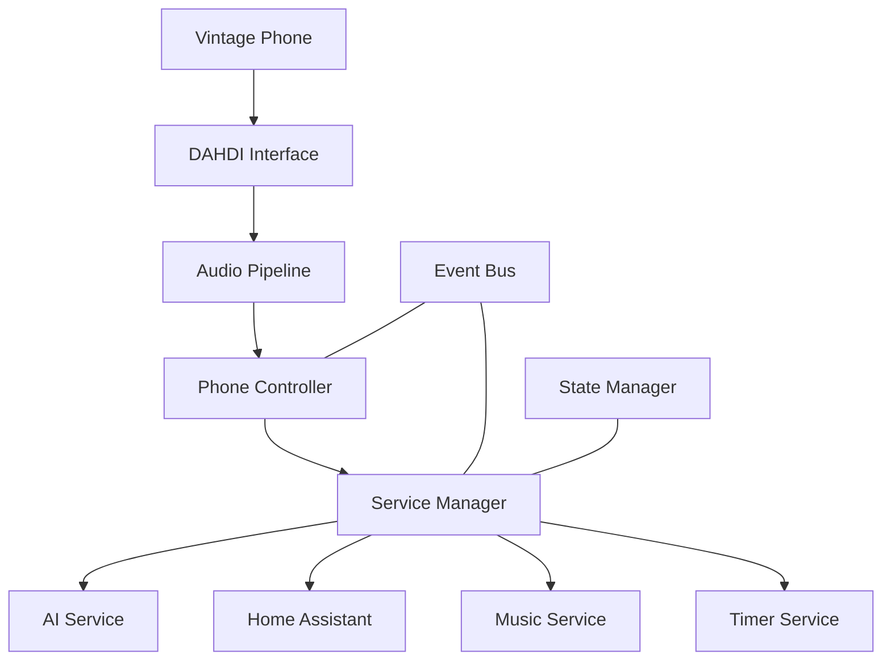

# Iroh Technical Specification

## Project Overview

Iroh is an AI-powered interface for vintage telephones that provides smart home control, voice interaction, and media playback capabilities. The system integrates with DAHDI hardware to bridge analog telephony with modern digital services.

## System Architecture

### Core Components

1. Hardware Layer
   - DAHDI/FXS Interface
   - Audio Processing Pipeline
   - Hardware Monitoring

2. Service Layer
   - AI Service (Claude & ElevenLabs)
   - Home Assistant Integration
   - Music Service
   - Timer Service

3. Control Layer
   - Phone Controller
   - Service Manager
   - Event Bus
   - State Manager

### Component Relationships



## Type System

### Core Types (src/types/index.ts)

```typescript
// Base configuration types
export interface Config {
    app: AppConfig;
    audio: AudioConfig;
    ai: AIConfig;
    music: MusicConfig;
    home: HomeConfig;
    logging: LogConfig;
}

export interface AppConfig {
    name: string;
    env: 'development' | 'production' | 'test';
    port: number;
    dataDir?: string;
}

// Hardware configuration
export interface AudioConfig {
    sampleRate: 8000;  // DAHDI requires 8kHz
    channels: 1;       // DAHDI requires mono
    bitDepth: 16;      // DAHDI requires 16-bit
    vadThreshold: number;
    silenceThreshold: number;
    bufferSize?: number;
}

// Service configurations
export interface AIConfig {
    anthropicKey: string;
    elevenLabsKey?: string;
    openAIKey?: string;
    maxTokens?: number;
    temperature?: number;
    voiceId?: string;
}

export interface MusicConfig {
    spotifyClientId?: string;
    spotifyClientSecret?: string;
    appleMusicKey?: string;
}

export interface HomeConfig {
    url: string;
    token: string;
    entityPrefix?: string;
    updateInterval?: number;
}

export interface LogConfig {
    level: 'debug' | 'info' | 'warn' | 'error';
    directory: string;
    maxFiles: string;
    maxSize: string;
    console?: boolean;
}

// Controller configuration
export interface PhoneControllerConfig {
    fxs: {
        devicePath: string;
        sampleRate: 8000;
        impedance?: number;
    };
    audio: {
        bufferSize: number;
        channels: 1;
        bitDepth: 16;
        vadThreshold?: number;
    };
    ai?: {
        model?: string;
        apiKey?: string;
        temperature?: number;
    };
}

// Service status tracking
export interface ServiceStatus {
    isInitialized: boolean;
    isHealthy: boolean;
    lastError?: Error;
    metrics: {
        uptime: number;
        errors: number;
        warnings: number;
        lastChecked?: Date;
    };
}

// Error types
export class IrohError extends Error {
    constructor(message: string, public code: string) {
        super(message);
        this.name = 'IrohError';
    }
}

export class HardwareError extends IrohError {
    constructor(message: string) {
        super(message, 'HARDWARE_ERROR');
        this.name = 'HardwareError';
    }
}

export class ServiceError extends IrohError {
    constructor(message: string) {
        super(message, 'SERVICE_ERROR');
        this.name = 'ServiceError';
    }
}
```

### Hardware Types (src/types/hardware/dahdi.ts)

```typescript
export interface DAHDIConfig {
    devicePath: string;
    controlPath: string;
    sampleRate: 8000;  // Required by DAHDI
    channels: 1;       // Required by DAHDI
    bitDepth: 16;      // Required by DAHDI
    bufferSize: number;
    channel: number;
    monitorInterval?: number;
}

export interface DAHDIChannelConfig {
    channel: number;
    signaling: 'fxs_ls' | 'fxs_gs' | 'fxs_ks';
    echocancel?: {
        enabled: boolean;
        taps: number;
    };
    callerid?: {
        enabled: boolean;
        format: 'bell' | 'v23' | 'dtmf';
    };
    impedance: 600 | 900;
}

export interface DAHDIAudioFormat {
    sampleRate: 8000;
    channels: 1;
    bitDepth: 16;
    format: 'linear';
}

export interface DAHDIChannelStatus {
    isOpen: boolean;
    channel: number;
    alarms: number;
    signaling: {
        type: string;
        hookstate: 'onhook' | 'offhook';
        ringing: boolean;
    };
    levels?: {
        rxLevel: number;
        txLevel: number;
    };
}
```

### Audio Types (src/types/audio/index.ts)

```typescript
export interface AudioInput {
    sampleRate: number;
    channels: number;
    bitDepth: number;
    data: Buffer;
}

export interface AudioOutput {
    sampleRate: number;
    channels: number;
    bitDepth: number;
    data: Buffer;
    metadata?: Record<string, any>;
}

export interface DTMFEvent {
    digit: string;
    duration: number;
    timestamp: number;
    strength?: number;
}

export interface VoiceEvent {
    audio: Buffer;
    startTime: number;
    endTime: number;
    isFinal: boolean;
    confidence?: number;
}
```

### Service Types (src/types/services/index.ts)

```typescript
export interface AIService {
    initialize(): Promise<void>;
    processText(text: string): Promise<string>;
    processVoice(audioBuffer: Buffer): Promise<string>;
    generateSpeech(text: string): Promise<Buffer>;
    updateContext(key: string, value: any): Promise<void>;
    shutdown(): Promise<void>;
}

export interface MusicService {
    executeCommand(command: string): Promise<void>;
    play(query: string): Promise<void>;
    pause(): Promise<void>;
    next(): Promise<void>;
    previous(): Promise<void>;
    setVolume(level: number): Promise<void>;
    getStatus(): Promise<MusicStatus>;
}

export interface HomeService {
    initialize(): Promise<void>;
    executeCommand(command: string): Promise<void>;
    getEntityState(entityId: string): Promise<HAEntity>;
    getStatus(): Promise<HAStatus>;
    shutdown(): Promise<void>;
}
```

## Service Implementation Requirements

### Hardware Layer

1. DAHDI Interface
   - Must handle all direct communication with DAHDI drivers
   - Manages audio format conversion to/from DAHDI requirements
   - Provides hardware status monitoring and diagnostics
   - Implements error recovery for hardware failures

2. Audio Pipeline
   - Handles all audio processing in DAHDI-compatible format
   - Implements DTMF detection using Goertzel algorithm
   - Provides voice activity detection
   - Manages audio buffering and streaming

### Service Layer

1. AI Service
   - Handles all interactions with Claude API
   - Manages conversation context and state
   - Coordinates with ElevenLabs for speech synthesis
   - Implements streaming response handling

2. Home Assistant Service
   - Maintains connection to Home Assistant instance
   - Handles device state tracking and updates
   - Manages scene activation and device control
   - Implements state caching for performance

3. Music Service
   - Handles music service integration (Spotify/Apple Music)
   - Manages playback state and control
   - Implements audio streaming to DAHDI
   - Provides playlist and queue management

### Control Layer

1. Phone Controller
   - Manages phone state (hook, ringing, etc.)
   - Coordinates audio routing
   - Handles command processing
   - Provides user feedback

2. Service Manager
   - Coordinates between services
   - Manages service lifecycle
   - Handles cross-service operations
   - Provides centralized error handling

## Error Handling Strategy

### Error Types

1. Hardware Errors
   - DAHDI device errors
   - Audio format errors
   - Buffer overruns/underruns
   - Hardware timing errors

2. Service Errors
   - API failures
   - Authentication errors
   - Timeout errors
   - State synchronization errors

3. System Errors
   - Configuration errors
   - Initialization failures
   - Resource exhaustion
   - Critical failures

### Error Recovery Process

1. Error Detection
   - Monitor hardware status
   - Track service health
   - Validate state transitions
   - Check resource usage

2. Recovery Strategy
   - Hardware reset/reinitialize
   - Service restart
   - State restoration
   - User notification

3. Failure Handling
   - Graceful degradation
   - Safe state maintenance
   - User feedback
   - Error logging

## Logging Requirements

Every component must implement comprehensive logging:

1. Log Levels
   - ERROR: System failures and errors
   - WARN: Potential issues and degraded operations
   - INFO: Major state changes and operations
   - DEBUG: Detailed operational information

2. Log Format
   ```typescript
   {
       timestamp: string;
       level: 'error' | 'warn' | 'info' | 'debug';
       component: string;
       message: string;
       details?: Record<string, any>;
       error?: Error;
   }
   ```

3. Log Rotation
   - Daily rotation
   - 14-day retention
   - Size-based rotation (20MB max)
   - Compression of old logs

## Testing Requirements

Each component must include:

1. Unit Tests
   - Core functionality
   - Edge cases
   - Error handling
   - State management

2. Integration Tests
   - Service interactions
   - Hardware integration
   - Error recovery
   - Performance tests

3. System Tests
   - End-to-end scenarios
   - Load testing
   - Recovery testing
   - Long-running stability tests

## Development Process

1. Code Organization
   ```
   src/
     ├── types/          # Type definitions
     ├── hardware/       # Hardware interfaces
     ├── services/       # Service implementations
     ├── controllers/    # System controllers
     ├── utils/          # Shared utilities
     ├── config/         # Configuration
     └── tests/          # Test suites
   ```

2. Build Process
   - TypeScript compilation
   - Linting and formatting
   - Test execution
   - Documentation generation

3. Deployment
   - Docker container build
   - Configuration validation
   - Health checks
   - Monitoring setup

## Future Considerations

1. Scalability
   - Multiple phone support
   - Distributed deployment
   - Load balancing
   - Service redundancy

2. Security
   - API key management
   - Access control
   - Audit logging
   - Secure communication

3. Extensibility
   - Plugin system
   - Custom service integration
   - Command customization
   - Voice model selection
